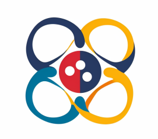

# US-Ukraine Quantum Forum 2023

## Location: Zoom
## Dates: August 28-31, 2023

This is the first event of this kind aiming to bring together quantum researchers from the United States and Ukraine. Quantum technologies play ever increasing role in the modern economy. Establishing collaborations will not only further strengthen the binational relation, but also lay the ground for Ukraine's revitalization. We hope that this forum will become a recurring event.

Topics covered include, but not limited to: Quantum information, computing, communication, sensing and metrology, optics, many-body and few-body systems, control, and open systems.

## Organizers

* [Denys Bondar](https://sse.tulane.edu/pep/faculty/bondar), Tulane University, USA
* [Andrii Sotnikov](https://sites.google.com/site/agsotnikov/), NSC KIPT and V.N. Karazin National University, Kharkiv, Ukraine

## Confirmed Invited Speakers

* Martina Barnas, Office of Naval Research Global, London, UK
* [Kurt Jacobs](http://www.quantum.umb.edu/Jacobs/), US Army Research Laboratory and University of Massachusetts, Boston
* [Adam Kaufman](https://jila.colorado.edu/kaufman), JILA, University of Colorado at Boulder
* [Ignacio Franco](https://www.sas.rochester.edu/chm/people/faculty/franco-ignacio/index.html), University of Rochester
* [Alexei Sokolov](https://physics.tamu.edu/directory/sokol/), Texas A&M University
* [Alexandra Boltasseva](https://engineering.purdue.edu/~aeb/), Purdue University
* [Alexander Burin](https://sse.tulane.edu/chem/faculty/burin), Tulane Univeristy
* [Christian Arenz](https://search.asu.edu/profile/4016702), Arizona State University
* [Sergey Frolov](https://www.physicsandastronomy.pitt.edu/people/sergey-frolov), University of Pittsburgh
* [Christopher Fuchs](http://www.physics.umb.edu/Research/QBism/chris.html), University of Massachusetts, Boston
* [Sebastian Deffner](https://physics.umbc.edu/people/faculty/deffner/), University of Maryland, Baltimore County
* [Matt Trusheim](https://scholar.google.com/citations?user=RUJ8W9wAAAAJ&hl=en), US Army Research Laboratory
* [Mikhail Lukin](https://www.physics.harvard.edu/people/facpages/lukin), Harvard University
* [Dimitris Giannakis](https://giannakis.host.dartmouth.edu/), Dartmouth College
* Dmitry Lyakh, NVIDIA Corporation

## Contributed Speakers
* [Ali Aliev](https://scholar.google.com.ua/citations?user=K8Uh20MAAAAJ&hl=en&oi=ao), University of Texas at Dallas
* [Mikhail Belogolovskii](https://scholar.google.com/citations?hl=en&user=jKromjQAAAAJ&view_op=list_works&sortby=pubdate) Comenius University, Bratislava, Slovak Republic and Kyiv Academic University, Ukraine
* [Igor Gapyak](https://scholar.google.com/citations?user=YPD5LR8AAAAJ&hl=en&oi=ao), Taras Shevchenko National University of Kyiv
* [Viktor Gerasimenko](https://scholar.google.com/citations?user=BkJhoJ8AAAAJ&hl=en&oi=sra), Institute of mathematics of National Academy of Sciences of Ukraine of Ukraine
* [Khrystyna Gnatenko](https://scholar.google.com/citations?hl=en&user=2W2w7pEAAAAJ), Ivan Franko National University of Lviv
* [Mykhaylo Khoma](https://scholar.google.com/citations?user=brdZXv4AAAAJ&hl=en&oi=ao), Institute of Electron Physics, National Academy of Sciences of Ukraine, Uzhhorod
* [Yuriy Kurioz](https://scholar.google.com/citations?user=athGK8gAAAAJ&hl=en&oi=sra), Institute of Physics, Kyiv
* [Robert Lompay](https://scholar.google.com/citations?user=7OPnn9EAAAAJ&hl=en&oi=ao), Uzhhorod National University
* [Illia Lukin](https://scholar.google.com/citations?user=xHhKp7gAAAAJ&hl=en&oi=sra), NSC KIPT and V.N. Karazin National University, Kharkiv
* [Andrii Semenov](https://scholar.google.com.ua/citations?user=aUco_KwAAAAJ&hl=en), Bogolyubov Institute for Theoretical Physics and Kyiv Academic University and Institute of Physics, Kyiv
* [Sergey Shevchenko](https://scholar.google.com.ua/citations?user=TfSG1KoAAAAJ&hl=en&oi=ao), Verkin Institute for Low Temperature Physics and Engineering, Kharkiv
* [Gleb Skorobagatko](https://scholar.google.com/citations?user=H6aPF8EAAAAJ&hl=en&oi=ao), Institute for Condensed Matter Physics of National Academy of Sciences of Ukraine, Lviv
* [Maksym Teslyk](https://scholar.google.com.ua/citations?user=BjcJn_IAAAAJ&hl=en&oi=ao), Taras Shevchenko National University of Kyiv
* [Vladyslav Unukovych](https://scholar.google.com/citations?user=tcJbX6cAAAAJ&hl=en&oi=ao), V.N. Karazin National University, Kharkiv

## Schedule
Day 1, Monday, August 28

| Time (US) EST  | Time (UA) EET  | Activity / Speaker      |
| -------------- | -------------- | :----------------------:|
| 10:00 - 10:40  | 17:00 - 17:40  | Opening - Denys Bondar  |
| 10:40 - 11:20  | 17:40 - 18:20  | Invited Talk (TBA)      |
|  |  short break | |
| 11:40 - 12:20  | 18:40 - 19:20  | Invited Talk (TBA)      |
| 12:20 - 13:00  | 19:20 - 20:00  | Invited Talk (TBA)      |

Day 2, Tuesday, August 29

| Time (US) EST  | Time (UA) EET  | Activity / Speaker      |
| -------------- | -------------- | :----------------------:|
|  7:00 -  7:20  | 14:00 - 14:20  | Khrystyna Gnatenko  |
|  7:20 -  7:40  | 14:20 - 14:40  | Maksym Teslyk   |
|  7:40 -  8:00  | 14:40 - 15:00  | Andrii Semenov  |
|  |  short break | |
|  8:20 -  8:40  | 15:20 - 15:40  | Mikhail Belogolovskii   |
|  8:40 -  9:00  | 15:40 - 16:00  | Ali Aliev    |
|   |  long break | |
| 10:00 - 10:40  | 17:00 - 17:40  | Sebastian Deffner       |
| 10:40 - 11:20  | 17:40 - 18:20  | Invited Talk (TBA)      |
|  |  short break | |
| 11:30 - 12:10  | 18:30 - 19:10  | Invited Talk (TBA)      |
| 12:10 - 12:50  | 19:10 - 19:50  | Invited Talk (TBA)      |
|  |  short break | |
| 13:00 - 13:40  | 20:00 - 20:40  | Informal Discussion     |

Day 3, Wednesday, August 30

| Time (US) EST  | Time (UA) EET  | Activity / Speaker      |
| -------------- | -------------- | :----------------------:|
| 7:00 - 7:20  | 14:00 - 14:20  | Igor Gapyak |
| 7:20 - 7:40  | 14:20 - 14:40  | Viktor Gerasimenko    |
| 7:40 - 8:00  | 14:40 - 15:00  | Illia Lukin |
|  |  short break | |
| 8:20 - 8:40  | 15:20 - 15:40  | Vladyslav Unukovych    |
| 8:40 - 9:00  | 15:40 - 16:00  | Andrii Sotnikov    |
|   |  long break | |
| 10:00 - 10:40  | 17:00 - 17:40  | Sergey Frolov           |
| 10:40 - 11:20  | 17:40 - 18:20  | Mikhail Lukin           |
|  |  short break | |
| 11:30 - 12:10  | 18:30 - 19:10  | Alexandra Boltasseva      |
| 12:10 - 12:50  | 19:10 - 19:50  | Invited Talk (TBA)      |
|  |  short break | |
| 13:00 - 13:40  | 20:00 - 20:40  | Informal Discussion     |

Day 4, Thursday, August 31

| Time (US) EST  | Time (UA) EET  | Activity / Speaker      |
| -------------- | -------------- | :----------------------:|
| 7:00 - 7:20  | 14:00 - 14:20  | Mykhaylo Khoma    |
| 7:20 - 7:40  | 14:20 - 14:40  | Robert Lompay    |
| 7:40 - 8:00  | 14:40 - 15:00  | Yuriy Kurioz    |
|  |  short break | |
| 8:20 - 8:40  | 15:20 - 15:40  | Gleb Skorobagatko    |
| 8:40 - 9:00  | 15:40 - 16:00  | Sergey Shevchenko    |
|   |  long break | |
| 10:00 - 10:40  | 17:00 - 17:40  | Alexei Sokolov          |
| 10:40 - 11:20  | 17:40 - 18:20  | Invited Talk (TBA)      |
|  |  short break | |
| 11:40 - 12:20  | 18:40 - 19:20  | Christopher Fuchs      |
| 12:20 - 13:00  | 19:20 - 20:00  | Invited Talk (TBA)      |
| 13:00 - 13:20  | 20:00 - 20:20  | Closing Remarks         |

## Important Notice for Potential Ukrainian Participants 

<!-- To be selected for presentations, participants from Ukraine [must submit the extended abstract](https://cmt3.research.microsoft.com/User/Login?ReturnUrl=%2FUSUAqForum2023) using [this LaTeX template](./surname_name.tex) **before July 10, 2023**. -->
The abstracts submitted by Ukrainian participants will be published in the accompanying proceedings (see also [the book of abstracts](./Abstracts_USUAqForum_2023.pdf)).  
To be included to the mailing list for the key updates about the qForum, please, fill [this form](https://docs.google.com/forms/d/e/1FAIpQLSd4YCYAoZ8ZqiDg4kaEN6MXU5mSl40uhA3tXprs7A7aKjlatw/viewform?usp=sf_link) (optional).

## The event is sponsored by

